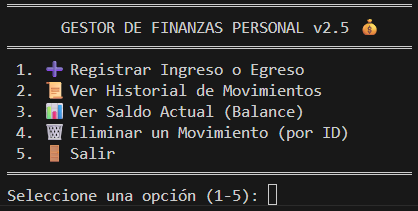

# 💰 Gestor de Finanzas Personales

Este es un sistema robusto desarrollado en **Python** para el control de finanzas personales. Integra una base de datos **MySQL** para el manejo profesional de datos y persistencia segura, permitiendo un seguimiento detallado de ingresos y egresos.

## 🚀 Funcionalidades
- **Registro Detallado:** Ingreso de descripción, monto, fecha, tipo (Ingreso/Egreso) y categoría.
- **Balance Automático:** Calcula el saldo real en tiempo real restando gastos de ingresos.
- **Historial Formateado:** Visualización de movimientos en tablas organizadas por consola.
- **Gestión de Datos:** Capacidad para eliminar registros específicos mediante su ID único.
- **Arquitectura Modular:** Separación de responsabilidades entre configuración, consultas y lógica de usuario.

## 🛠️ Stack Tecnológico
- **Lenguaje:** Python 3.x
- **Base de Datos:** MySQL 8.0
- **Conector:** `mysql-connector-python`
- **IDE:** Visual Studio Code en Windows 11

## 📋 Requisitos e Instalación

1. **Instalar el conector de MySQL:**
   ```bash
   pip install mysql-connector-python

2. **Configurar el acceso:** Asegúrate de actualizar tus credenciales en el archivo `db_config.py`.
3. **Ejecutar el programa:**
   ```bash
   python main.py


## 🖼️ Vista del Menú Principal




## ⚙️ Configuración de MySQL

Para que el sistema funcione, se debe ejecutar el siguiente script en el cliente SQL (como MySQL Workbench) para crear la base de datos y la tabla:

-- 1. Crear la base de datos

   CREATE DATABASE gestor_finanzas;

USE gestor_finanzas;

-- 2. Crear la tabla de transacciones
   
   CREATE TABLE transacciones (
       id INT AUTO_INCREMENT PRIMARY KEY,
       fecha DATE,
       descripcion VARCHAR(255),
       categoria VARCHAR(50) DEFAULT 'General',
       tipo ENUM('Ingreso', 'Egreso'),
       monto DECIMAL(10, 2)
   );


## 📁 Estructura del Proyecto

- `main.py`: Interfaz de usuario, manejo del menú interactivo y validación de entradas.

- `consultas.py`: Lógica de comunicación con el servidor MySQL (operaciones CRUD).

- `db_config.py`: Parámetros de conexión y función para obtener el objeto de conexión.


## 👤 Autor
Inosencio Perez - Junior Python Developer

GitHub: Inosencio-Perez

Este proyecto destaca por el uso de bases de datos relacionales y diseño de software modular para el portfolio profesional.